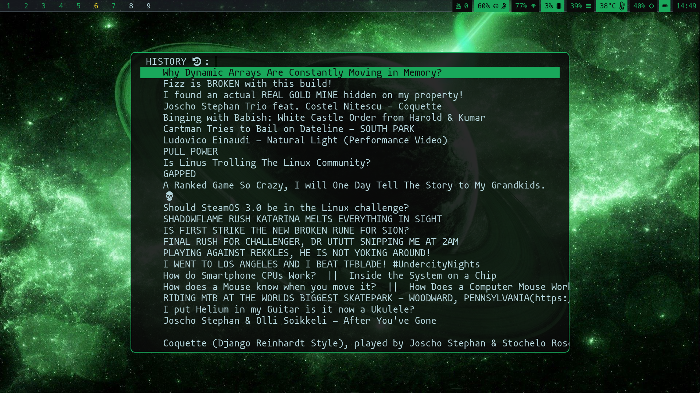

# SUBTUBE

Some of my script use following form to store played youtube videos with name:
**TITLE SEPARATOR VIDEO_URL**
This script parses it and allows you to replay those (and more).

# DEPENDENCIES
Currently supports wayland setup only.
* [fuzzel](https://codeberg.org/dnkl/fuzzel)

# POPULATORS
2 programs populate my *mpv_history database*
* [subtube](https://github.com/nagy135/subtube)
* [qutebrowser userscript](https://github.com/nagy135/dots/blob/master/qutebrowser/.local/share/qutebrowser/userscripts/mpv_play)

# TODO
* xorg version
* publish qutebrowser userscript here
* modify subtube path to support this
